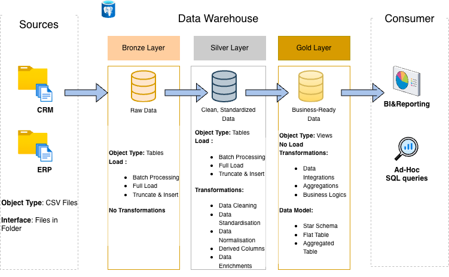

# Data Warehouse and Analytics Project

I built this to get hands-on experience with the full data warehousing workflow - from raw data ingestion to SQL-based analytics, following industry standard practices.

---

## Data Architecture

The warehouse is structured around Medallion Architecture with three progressive layers:

1. **Bronze Layer**: Raw data ingested as-is from ERP and CRM CSV files into PostgreSQL. No transformations applied.
2. **Silver Layer**: Data is cleaned, standardized, and normalized here — this is where the messy stuff gets handled.
3. **Gold Layer**: Business-ready data modeled into a star schema, optimized for reporting and analytical queries.

---

## What This Project Covers

- Designing a data warehouse using Medallion Architecture
- Building ETL pipelines from raw source files to analytical models
- Data modeling with fact and dimension tables (star schema)
- SQL-based analytics for business insights

---

## Data Sources

Two source systems provided as CSV files:

- **ERP** — transactional sales and product data
- **CRM** — customer profiles and records

Both are integrated in the Gold layer into a single unified model.

---

## Stack

PostgreSQL — data warehouse database  
pgAdmin 4 — GUI for managing and querying PostgreSQL  
DrawIO — architecture and data model diagrams  
Git & GitHub — version control

## Project Phases

*In progress — will be updated as each phase is completed.*

---

## About Me

I'm **Akshara**, a Computing and Information Technologies student at Rochester Institute of Technology (Dean's List), actively building a portfolio in data engineering and analytics. This project is one of several end-to-end projects I'm working on to develop practical, job-ready skills.
